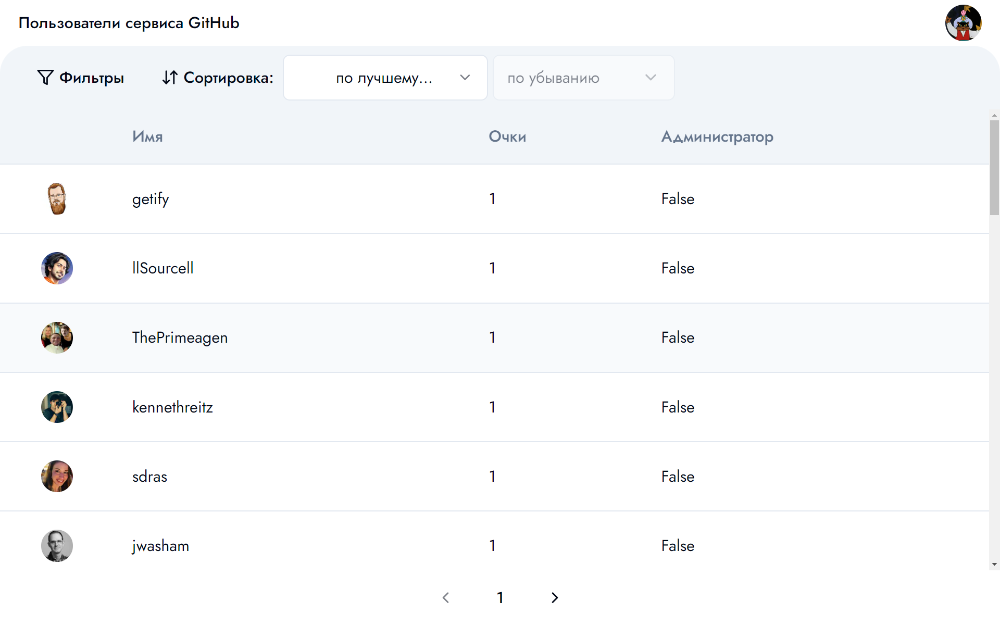
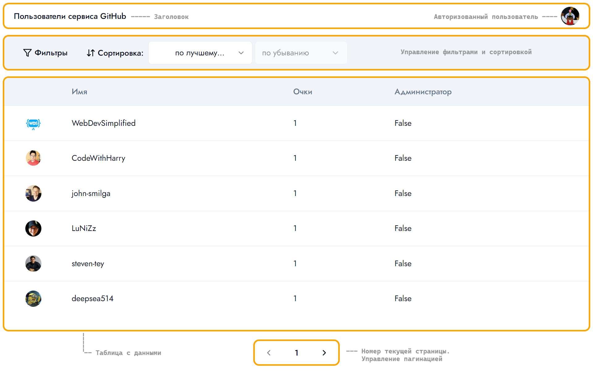
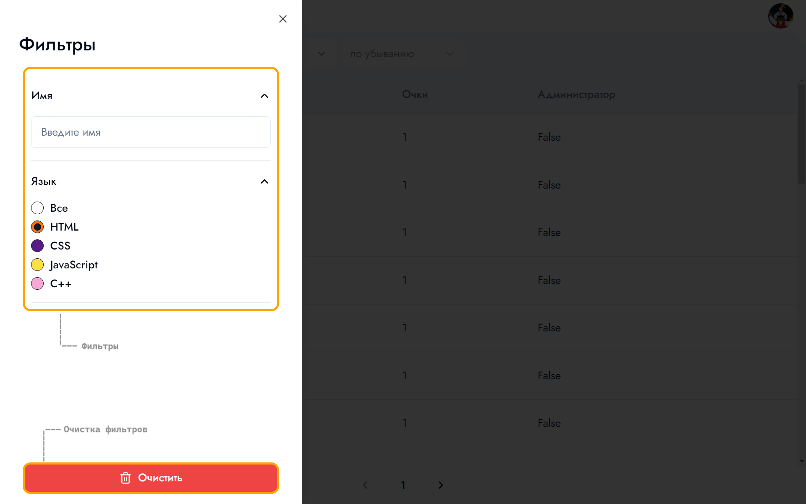
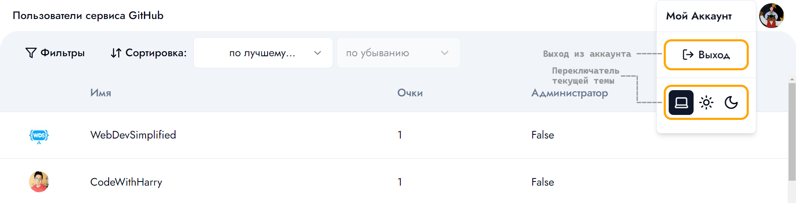
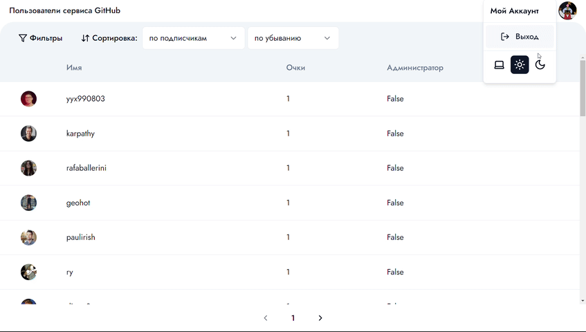

## Описание проекта

GitHub-Users - это веб-приложение для поиска и просмотра пользователей сервиса [GitHub](https://github.com/).



Цель - демонстрация получения и развития навыков на практике.

## Страницы

| Путь    | Описание                               |
| ------- | -------------------------------------- |
| /       | Главная страница с отображением данных |
| /signin | Авторизация пользователя               |

## Интерфейс

### Главная страница



### Панель с фильтрами



### Меню пользователя



### Изменение темы



## Требования к приложению

### Минимальные:

1. Написать приложение с использованием Next.js.
2. Приложение должно растягиваться на всю доступную ширину и высоту, если что-то не влезает – показывать скролл. Скролл не на всю страницу, а отдельный скролл для фильтра и отдельный скролл для таблицы. Шапка таблицы с пагинатор не должны скроллиться по вертикали.
3. В качестве данных использовать [GitHub API](https://docs.github.com/ru/rest/search/search?apiVersion=2022-11-28#search-users).
4. Фильтры в боковой панели могут быть любыми (минимум должно быть два фильтра). Колонки тоже могут быть любыми.
5. В момент запроса беккенда должен показываться лоадер который блокирует все нажатия и ввод текста в фильтрах. Лоадер реализовать с помощью HTML и анимировать с помощью CSS.
6. Должна быть реализована обработка ошибок запроса. Ошибка должна отобразиться в модальном окне.
7. Если запрос не вернул ничего, то вместо таблицы показать текст посередине «Пользователи не нашлись».
8. Боковая панель с фильтрами должна уметь сворачиваться и разворачиваться. Эти действия нужно аннимировать.
9. Сортировка должна быть в шапке столбцов или отдельными элементами управления.
10. Значения фильтров, пагинацию, сортировку хранить в localStorage. После перезагрузки страницы эти значения не должны теряться.
11. Стили должны быть реализованы на flexbox или grid.
12. Классы для DOM элементов должны соответствовать методологии БЭМ, или должны быть реализованы CSS модули, или должен быть использован [Tailwind](https://tailwindcss.com/) или CSS in JS.
13. Написать минимум один Unit-тест с использованием [Jest](https://jestjs.io/ru/). Написать минимум один тест с использованием [React Testing Library](https://testing-library.com/docs/react-testing-library/intro/).

### Дополнительно:

1. Реализовать темную и светлую тему.

## Приступая к работе

### Cистемные и программные требования:

- macOS, Windows (включая WSL), Linux
- [Node.js 18.17](https://nodejs.org/en) или позднее

### Запуск

1. Перейдите в директорию проекта

```bash
cd github-users
```

2. Установите зависимости с помощью команды:

```bash
npm install
# или
yarn install
# или
pnpm install
# или
bun install
```

3. Запустите сервер разработки:

```bash
npm run dev
# или
yarn dev
# или
pnpm dev
# или
bun dev
```

Откройте в браузере [http://localhost:3000](http://localhost:3000), чтобы увидеть результат.

## Технологии

Приложение было написано с использованием следующих технологий:

- Язык - [TypeScript](https://www.typescriptlang.org/)
- Фреймворк - [Next.js](https://nextjs.org/docs)
- CSS - [Tailwind](https://tailwindcss.com/)
- Авторизация - [Next Auth](https://next-auth.js.org/)
- UI-компоненты - [shadcn/ui](https://ui.shadcn.com/)
- Тестирование - [Jest](https://jestjs.io/ru/), [React Testing Library](https://testing-library.com/docs/react-testing-library/intro/)
- Линтинг - [ESLint](https://eslint.org/)
